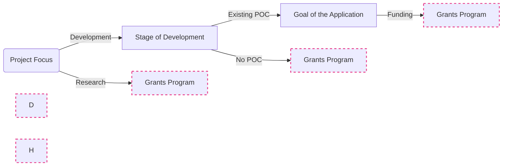

If you are certain you want to apply for a EW CF grant, head straight to our [application process documentation](Process/how-to-apply.md). Otherwise, check out the flowchart below for a broad overview of which funding source your application might fit best.

## Funding Opportunities Overview

